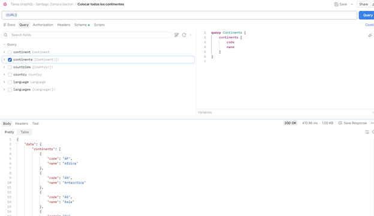
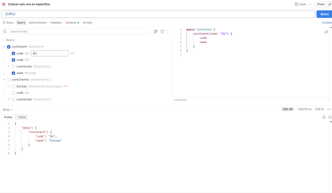
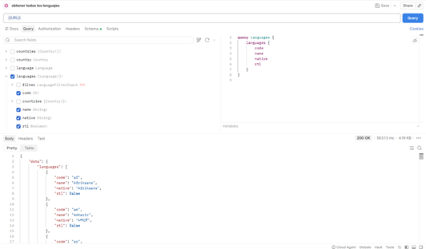
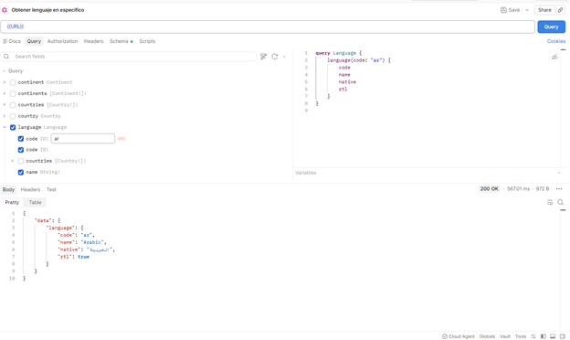
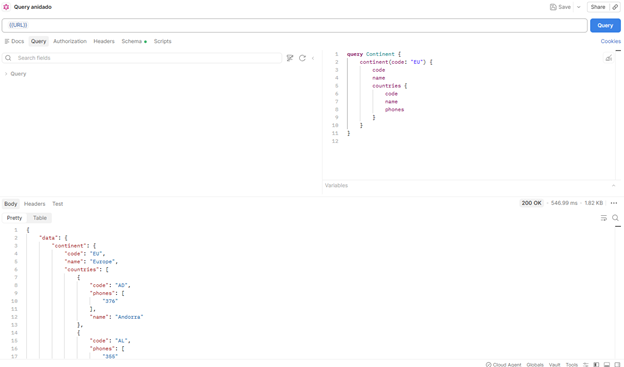
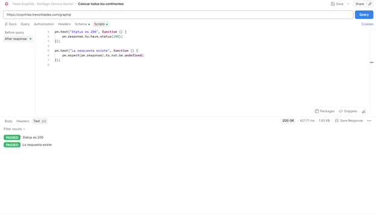

# Métodos get que podemos usar en Pokémon

## Query Continents:

---

## Query de continente en específico:

---

## Query de todos los idiomas:

---

## Query de un idioma en específico:
---

## Query de países con información anidada:

---
## Query con test :

---

### → ¿Qué diferencia encontraste vs REST?

Que en GraphQL se necesita solo un URL para poder elegir que queremos colocar, esto en un solo endpoint y no necesitamos varios URLS para querer filtrar nuestro json. Además, no es necesario colocar toda la información, sino que podremos poner la que nos importa sin necesidad de hacer más pasos.

---

### → ¿Cuántos requests REST necesitarías para reemplazar tu query más compleja?

En el request anidada que es de un continente con sus países. Mientras que en el GraphQL solo se necesita una request para el continente y país. En REST usaremos varias request para los países que hay en el continente.

---

### → ¿En qué proyecto real usarías GraphQL?

Las usaría en apps tipo redes sociales en las cuales podría filtrar la información de una manera mas comoda y rápida o también en información grande como lo puede ser misiones espaciales o un proyecto que requiera una optimización rápida para tanta información.

---

