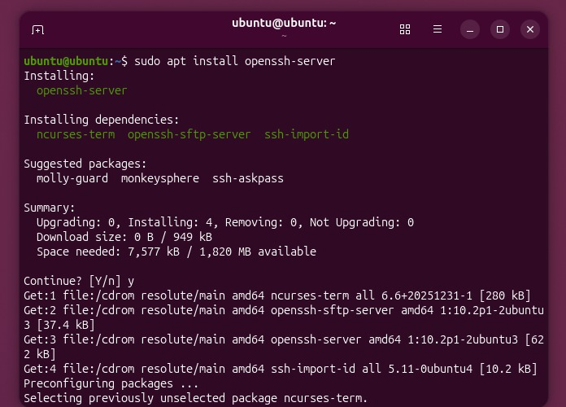
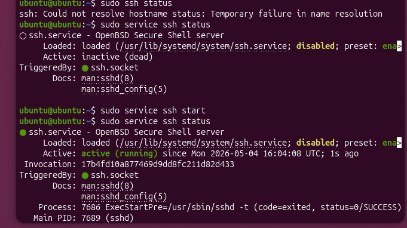
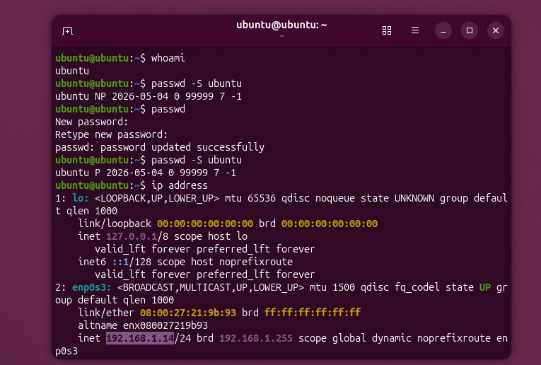
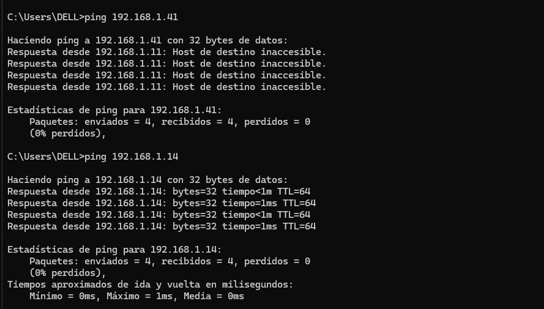
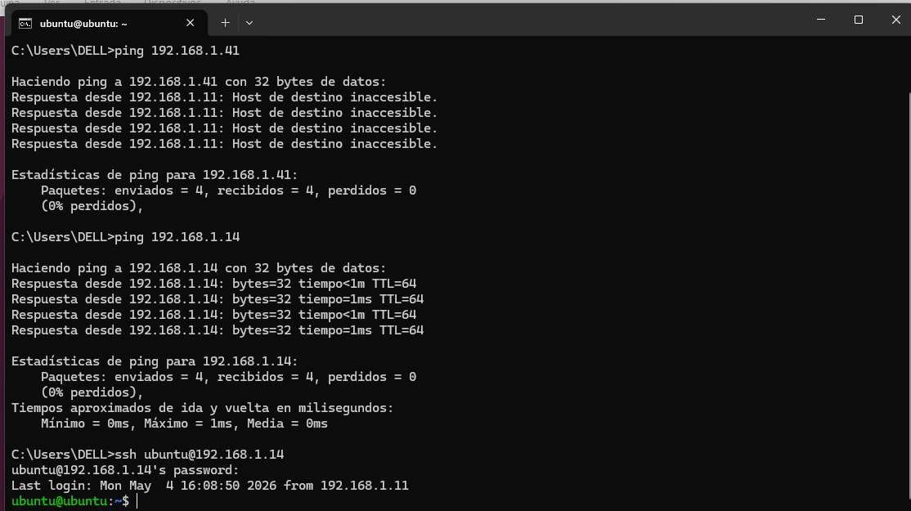
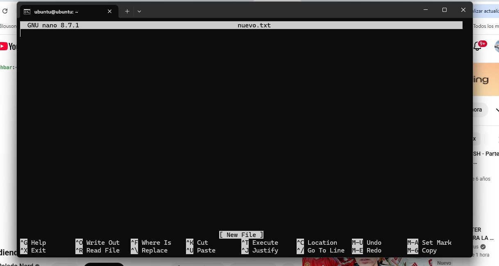

# Metodo SSH
## -**Introduccion:**
---
Durante la clase hemos visto varias maneras en la que podremos asegurar de una mejor manera nuestra información como JSON, Pero se miro una nueva alternativa como lo es SSH.

Este es una protocolo en el cual permite al cliente y servidor ponerse de acuerdo para un metodo de autenticación , con el cual los dos dispositivos de podran comunicar y de esa manera poder tener una conexión segura de los archivos que se vayan transmitiendo.

La manera en la que funciona el protocolo esta basado en:
### - **Establecimiento de la conexión**
  Cuando el cliente (tu PC) se conecta al servidor:

Se ponen de acuerdo en:
  Algoritmos de cifrado 
  Algoritmos de hash 
  Se crea una clave de sesión usando criptografía como Diffie-Hellman

### -**Autenticación**
  aquí el servidor verifica tu identidad. Hay dos formas principales:

  Usuario + contraseña
  Más simple, pero menos seguro
  Llaves públicas/privadas (lo que mencionaste)

### -**Canal de cifrado**
  En donde vamos a enviar y recibir archivos, contraseñas e informacion de interes cifrada.

---
# Proceso de instalación.
Si estamos en linux, pues ya tenemos un cliente SH para poder conectarlos , entonces no debemos crear uno como lo tendriamos que hacer en windows. En el cual podremos usar un entorno virtual para hacer el cliente SH.

Ahora instalado el virtual box le colocamos una iso de linux , en mi caso coloque la ultima de ubuntu. Ya con esto debemos colocar el usuario y la contraseña con el cual podremos conectarnos con el usuario y poder pasar la informacion de manera segura. Despues de eso ya iniciamos esta instancia y comenzamos a instalar el SSH si no esta instalado .

Ya con eso hecho el paso a seguir es mirar con los comandos de status si ya esta iniciada la conexion, si aun no es el que caso la iniciamos y volvemos a mirar su estado. Terminado esto , lo que debmos hacer es identificar cual es nuestro usuario y comprobar que tenga contraseña , esto se mira con el comando "passwd -S "nombre del usuario" " y si tiene una parte con NP , es que debemos asignarle una contraseña.

Ya configurada las credenciales para la conexión debemos mirar que dirreción IP tenemos para poderlo conectar ahora con el otro dispositivo.

Ya en otro terminal miraremos primero si esta conectado la dirreción IP con un ping a este , si ya funciona y pasa los paquetes ahora debemos iniciar la conexion SSH y ya con este podremos modificar informacion de manera segura , como lo puede ser una texto.

