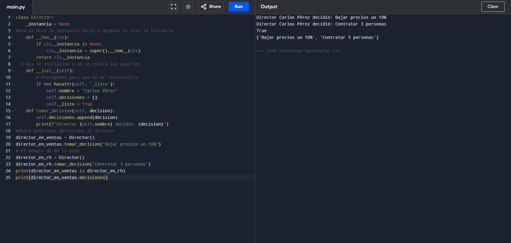
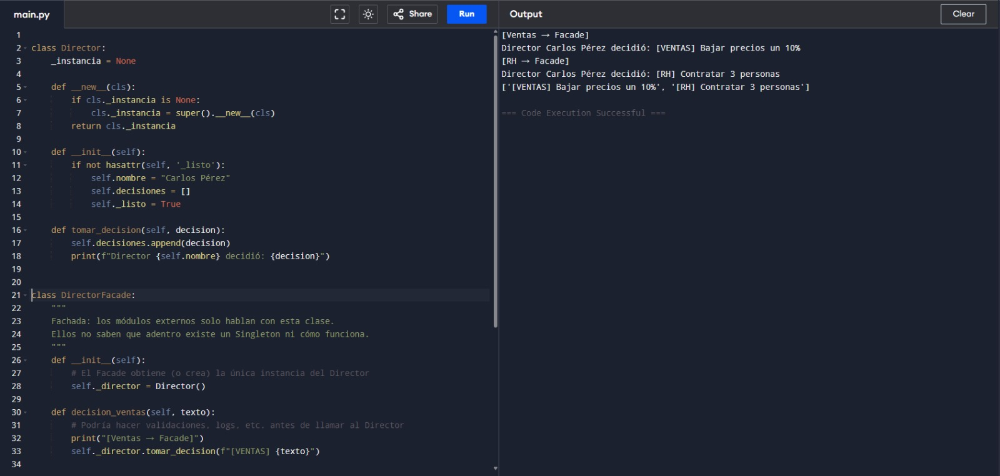
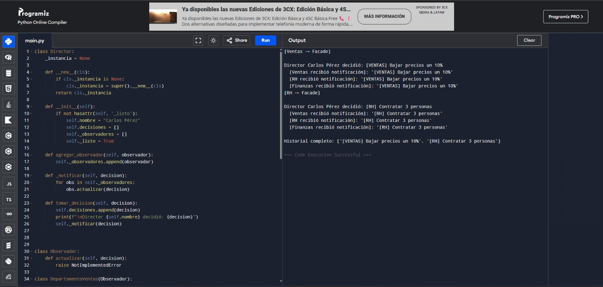

# Patrones de diseño: Singleton y Facade

---

## Caso 1 — Singleton puro

El código define una clase `Director` que representa al único director de una empresa.

### Declaración de la instancia

Lo primero que hace es declarar `_instancia = None` como variable de clase, que es el "cajón" donde se va a guardar la única instancia.

### Método `__new__`

Es el método que Python llama antes de crear cualquier objeto. Aquí está el truco del Singleton: revisa si `_instancia` está vacía, y solo si lo está crea el objeto con `super().__new__(cls)`. Si ya existe, simplemente devuelve el que ya hay. Así bloquea cualquier intento de crear un segundo director.

### Método `__init__`

Inicializa el nombre y la lista de decisiones, pero tiene una protección extra con `hasattr(self, '_listo')` que evita que se reinicialicen esos datos si alguien vuelve a llamar `Director()` accidentalmente.

### Método `tomar_decision`

Simplemente agrega la decisión a la lista y la imprime.

### Prueba del patrón

Al final del código se prueba todo: se crea `director_en_ventas` y toma una decisión, luego se crea `director_en_rh` y toma otra. Aunque parecen objetos distintos, el `print(director_en_ventas is director_en_rh)` devuelve `True` porque son el mismo objeto, y `decisiones` tiene las dos decisiones juntas en la misma lista.

---

## Caso 2 — Singleton + Facade

Este código parte del mismo `Director` Singleton sin tocarlo, y agrega encima una capa nueva llamada `DirectorFacade`.

### Método `__init__` del Facade

La clase `DirectorFacade` en su `__init__` obtiene la instancia del `Director` llamando a `Director()` y la guarda en `self._director`. Desde ese momento, el Facade es el único que habla con el Director directamente.

### Método `decision_ventas`

Recibe un texto, imprime un aviso de que viene del módulo de ventas, y llama a `tomar_decision` del Director añadiendo la etiqueta `[VENTAS]` al inicio.

### Método `decision_rh`

Hace exactamente lo mismo que `decision_ventas` pero con la etiqueta `[RH]`. Esto permite saber de dónde vino cada decisión al revisar el historial.

### Método `ver_historial`

Devuelve la lista `decisiones` del Director sin exponer el objeto Director en sí.

### Prueba del patrón

Al usarlo, se crea una sola instancia del Facade, y desde ahí se llaman los dos métodos. El resultado es que el historial queda ordenado con etiquetas, y ningún módulo externo tuvo que saber que existe un Singleton ni cómo construirlo.

# Patrones de diseño: Singleton, Facade y Observer

## Caso 3 — Singleton + Facade + Observer

Este código agrega el patrón de comportamiento **Observer** sobre los dos anteriores.

### ¿Por qué Observer y no otro patrón de comportamiento?

El `Director` toma decisiones que afectan a toda la empresa. En lugar de que él llame uno por uno a cada departamento, con Observer los departamentos se **suscriben** y se enteran automáticamente. El Director no necesita saber quiénes lo escuchan.

### Clase `Observador` (interfaz base)

Define el contrato que todos los departamentos deben cumplir: tener un método `actualizar(decision)`. Esto garantiza que el Director pueda notificar a cualquier observador sin importar de qué departamento se trate.

### Clases `DepartamentoVentas`, `DepartamentoRH`, `DepartamentoFinanzas`

Cada una implementa `actualizar` a su manera. Cuando el Director notifica, cada departamento reacciona de forma independiente. Si mañana se agrega un `DepartamentoLegal`, solo se crea la clase y se suscribe, sin tocar nada más.

### Cambios en el `Director` (Singleton)

Se agregan dos elementos nuevos:

- `self._observadores = []`: lista donde se registran todos los suscriptores.
- `agregar_observador(observador)`: permite que cualquier departamento se suscriba.
- `_notificar(decision)`: recorre la lista y llama a `actualizar` en cada observador justo después de tomar una decisión.

### Cambios en el `DirectorFacade`

El Facade ahora también se encarga de registrar los observadores al inicializarse. Esto mantiene toda la configuración en un solo lugar, y los módulos externos no tienen que preocuparse por suscribirse manualmente.

### Flujo completo de una decisión

| Patrón | Para qué sirve | ¿Aplica aquí? |
|---|---|---|
| **Observer** | Notifica automáticamente a varios módulos cuando algo cambia | ✅ Sí, es exactamente lo que necesitamos |
| Strategy | Intercambiar algoritmos en tiempo de ejecución | ❌ No hay algoritmos que cambiar |
| Command | Encapsular acciones como objetos para ejecutarlas luego | ❌ Añade complejidad innecesaria |
| Chain of Responsibility | Pasar una petición por una cadena de manejadores | ❌ No hay cadena de aprobación |
---

## Conclusión

